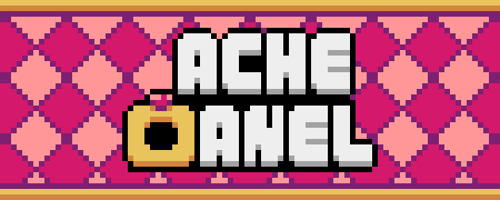
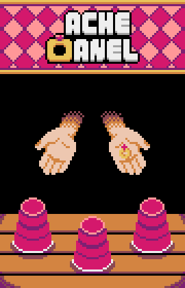

<header>

</header>

  <h3>Sobre o projeto</h3>

Divirta-se tentando adivinhar aonde está o anel!
Entretenha-se variando entre os modos do jogo ou escolha o seu modo favorito e curta a jogabilidade.

Criado através da linguagem python, com objetivo de começar um projeto do mais simples possível, o “Ache o Anel” é um game com jogabilidade simples que utiliza a interface gráfica e cálculos matemáticos da game engine Pyxel para brincar com valores aleatórios.

  <h3>Resultado</h3>
  <figure>
    
   
  </figure>

